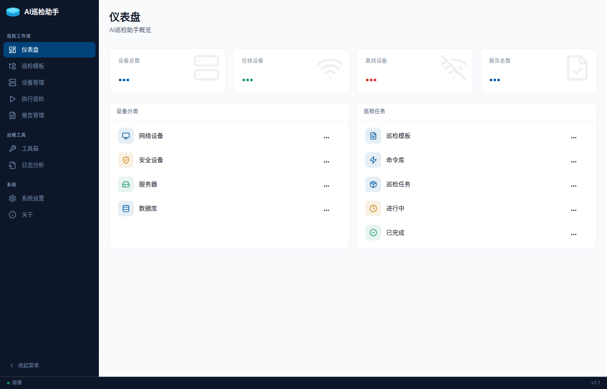
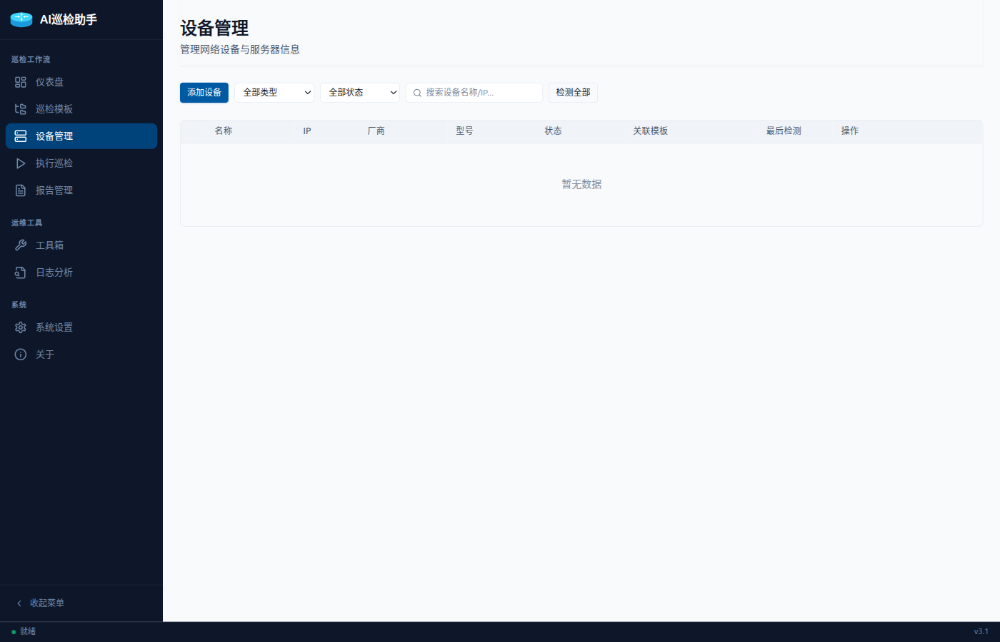
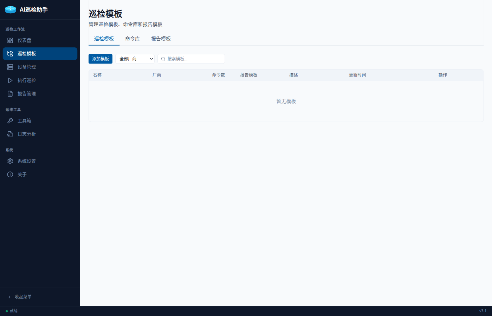
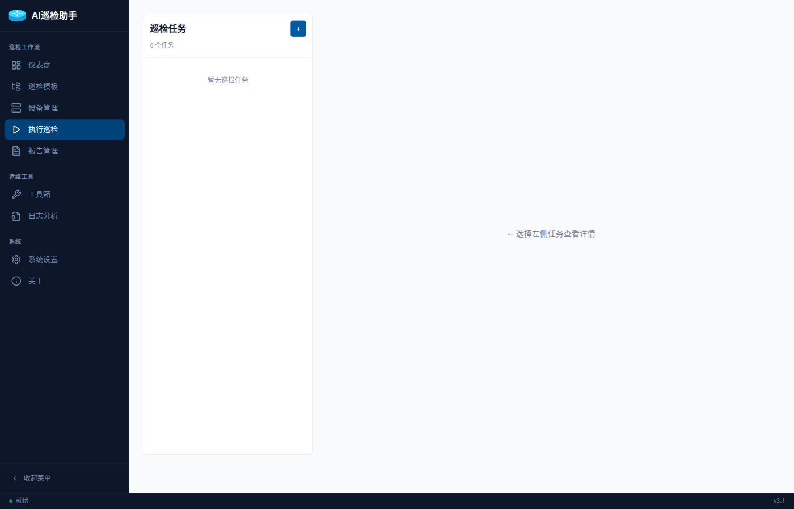
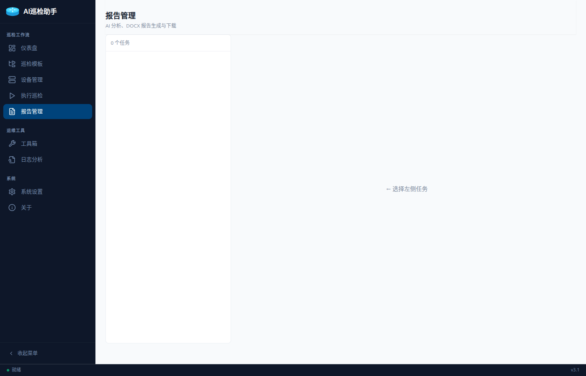
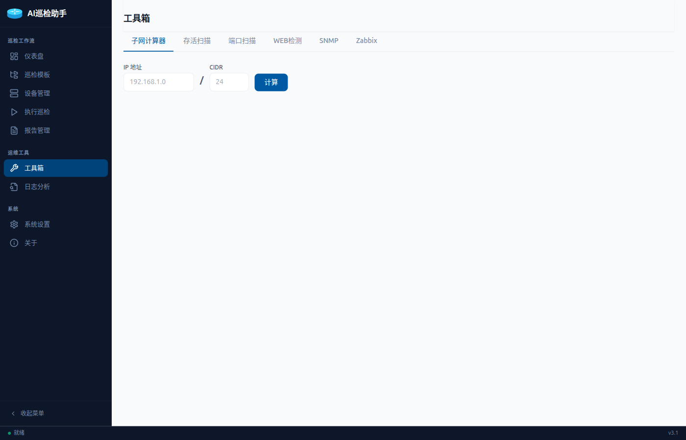
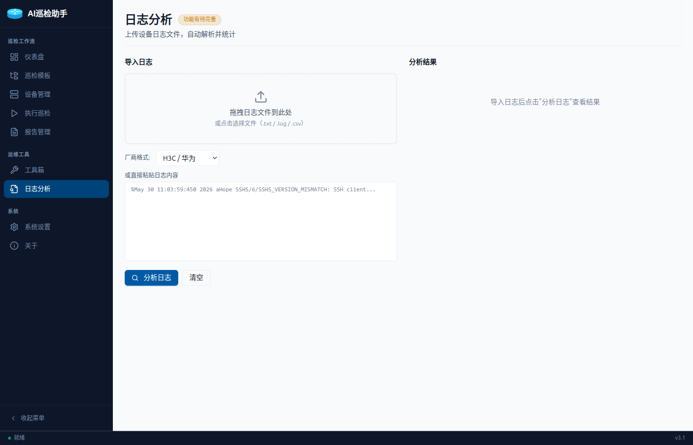
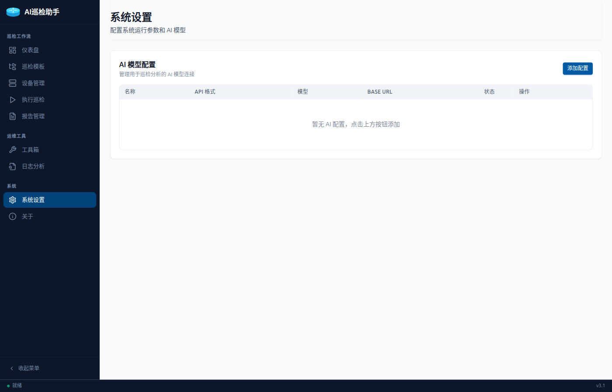

# AI巡检助手 — 用户操作手册

> 版本：v3.40.6 | 适用平台：Windows / Linux

---

## 目录

1. [安装与启动](#1-安装与启动)
2. [仪表盘](#2-仪表盘)
3. [设备管理](#3-设备管理)
4. [巡检模板](#4-巡检模板)
5. [执行巡检](#5-执行巡检)
6. [报告管理](#6-报告管理)
7. [工具箱](#7-工具箱)
8. [日志分析](#8-日志分析)
9. [系统设置](#9-系统设置)
10. [常见问题排查](#10-常见问题排查)

---

## 1. 安装与启动

### Windows

1. 从 [GitHub Releases](https://github.com/neowong/inspection-rust/releases) 下载最新版 `.exe` 安装包
2. 双击运行安装程序，按向导完成安装
3. 首次启动前，**确保已安装 Microsoft Edge WebView2 Runtime**——Win11 自带，Win10 若缺失请手动下载安装：[离线安装器](https://go.microsoft.com/fwlink/p/?LinkId=2124703)（~170MB）
4. 从桌面快捷方式或开始菜单启动 **AI巡检助手**

> **若启动无反应**：检查 `%TEMP%\inspection-debug.log`，或参见 [第 10 节：常见问题排查](#10-常见问题排查)

### Linux

```bash
# 从 Releases 下载 .deb 包
sudo dpkg -i inspection-rust_3.40.6_amd64.deb
# 终端启动
inspection-rust
```

---

## 2. 仪表盘

打开程序后的首页，展示系统全局概览。



核心指标卡片：
- **设备总数**：已录入的设备数量
- **在线设备**：最近一次检测连通成功的设备
- **巡检批次**：累积创建的巡检任务批次数
- **报告数量**：已生成的 DOCX 报告数

下半部分分两列展示设备分类统计和巡检任务统计。点击卡片可跳转到对应页面。

---

## 3. 设备管理

管理所有被巡检的设备，包括网络设备（H3C/华为/思科/锐捷/飞塔）、Linux 服务器和数据库。



### 3.1 添加设备

1. 点击右上角 **"+ 添加设备"** 按钮
2. 填写设备信息：

| 字段 | 说明 |
|------|------|
| 设备名称 | 自定义标识 |
| IP 地址 | 管理 IP |
| SSH 端口 | 默认 22 |
| 厂商 | H3C / 华为 / 思科 / 锐捷 / 飞塔 / Linux |
| 设备类型 | 网络设备 / 安全设备 / 服务器 / 数据库 |
| SSH 用户名 | 登录用户名 |
| SSH 密码 | 登录密码（加密存储）|

3. 点击 **"保存"**——保存后自动检测设备连通性，在线设备会自动获取型号、序列号等静态信息

### 3.2 列表操作

- **搜索**：按设备名称/IP 筛选（Ctrl+F 快速聚焦搜索框）
- **筛选**：按设备类型、在线状态筛选
- **检测**：点击行末 **"检测"** 按钮手动检测单台设备连通性
- **编辑/删除**：行末按钮操作；勾选多行后可点击顶部 **"批量删除"**
- **型号检测**：点击可触发 SSH 自动采集设备型号、序列号、出厂日期

---

## 4. 巡检模板

定义巡检时对设备执行哪些命令。



### 4.1 模板结构

模板按厂商标记（H3C/华为/思科/锐捷/飞塔/Linux），每个模板包含多条巡检命令。

### 4.2 创建模板

1. 切换到 **巡检模板** 页
2. 点击 **"+ 新建模板"**
3. 填写模板名称、选择适用厂商
4. 从右侧命令池**拖拽命令**到左侧模板命令列表（支持拖拽排序）
5. 为每条命令设置：
   - **巡检目的**：`inspection`（巡检项）/ `static_info`（静态信息采集）
   - **是否在报告中显示**：`show_in_report`
6. 点击 **"保存"**

### 4.3 命令池管理

命令池内置 **85+ 预置命令**，按厂商分 tab、按类别分组（可折叠展开）：

- **通用状态**：`display version`、`display device` 等
- **接口信息**：`display interface brief` 等
- **路由协议**：`display ip routing-table` 等
- **安全审计**：`display acl all` 等
- **无线管理**：`display wlan ap all` 等

预置命令支持编辑/删除。用户也可手动添加自定义命令。

---

## 5. 执行巡检

批量创建巡检任务，连接设备执行命令并实时追踪进度。



### 5.1 创建批次

1. 切换到 **巡检执行** 页
2. 点击 **"+ 新建批次"**
3. 填写批次名称，勾选要巡检的设备（多选）
4. 点击 **"创建并开始"**（立即执行）或 **"仅创建"**（稍后手动启动）

### 5.2 运行与监控

- 批次创建后系统自动为每台设备分配独立 SSH 会话，**多设备并发执行**
- 右侧面板显示批次详情：设备列表、各记录状态、执行进度
- 点击行可**展开查看逐条命令的实时输出**
- 操作按钮：
  - **执行**：启动已创建的批次
  - **暂停**：停止新命令下发，正在执行的命令完成后暂停
  - **停止**：立即终止所有执行中的 SSH 会话
  - **重启**：取消当前任务并重新开始
  - **重试**：对单条失败记录重新执行

---

## 6. 报告管理

基于巡检结果生成 DOCX 报告，支持 AI 分析和人工评判。



### 6.1 操作流程

1. 选中左侧批次列表的一个批次
2. 选择分析模式：
   - **AI 评判**：逐条发送命令输出给配置的 AI 模型，返回状态判定（ok / info / warning / critical），自动生成 DOCX 报告
   - **人工评判**：跳过 AI，直接生成报告
3. 点击记录行的 **"下载报告"** 下载单设备 DOCX
4. 点击顶部按钮下载批次报告：
   - **下载综合报告（ZIP）**：所有设备各一份 DOCX 打包
   - **下载综合报告（合并）**：合并为一个 DOCX，每设备新页开始

### 6.2 报告内容

DOCX 报告包含封面、基本信息表、巡检结果表（序号/巡检项目/巡检内容/评判结论）、AI 分析总结和总体评估。

---

## 7. 工具箱

集成的网络运维工具，不依赖已录入设备即可使用。



| 工具 | 功能 |
|------|------|
| 存活扫描 | ICMP ping + TCP 135/445 回退，CIDR 网段扫描 |
| TCP 端口扫描 | 指定端口范围 TCP connect 扫描 |
| UDP 端口扫描 | UDP 探针 + ICMP Port Unreachable 检测（DNS/SNMP/NTP）|
| WEB 检测 | HTTP/HTTPS 连通性和响应状态码 |
| SNMP v2c | Community 字符串 + OID GET |
| SNMP v3 | USM 认证（MD5/SHA1/SHA256）+ 加密（DES/AES128）|
| Zabbix Agent | 被动模式探测（agent.ping/version/hostname）|

---

## 8. 日志分析

解析网络设备系统日志，调用 AI 分析。



1. 上传设备日志文件（`.log` / `.txt`）
2. 选择日志格式（H3C/华为 或 思科）
3. 点击 **"开始分析"**
4. 系统解析每条日志：时间戳、主机名、模块、严重级别、消息体
5. 点击 **"导出 CSV"** 保存分析结果

---

## 9. 系统设置

管理 AI 模型配置，支持多个 AI 服务商随时切换。



### 9.1 添加 AI 配置

1. 点击 **"+ 添加配置"**
2. 填写：

| 字段 | 说明 |
|------|------|
| 配置名称 | 自定义标识 |
| 提供商 | OpenAI / Anthropic / DeepSeek |
| 模型 ID | 如 `gpt-4o`、`claude-fable-5`、`deepseek-chat` |
| API Key | 密钥（加密存储）|
| Base URL | 可选，自定义 API 地址（如代理/VPN 地址）|

3. 保存后点击行末 **"激活"** 按钮切换到该配置

> **注意**：编辑 AI 配置时 **API Key 留空不填** 则保持原值不变。SSH 密码同理。

---

## 10. 常见问题排查

### Q: Windows 安装后打开没反应 / 闪 cmd 窗口

1. 按 `Win+R`，输入 `%TEMP%\inspection-debug.log`，回车
2. 查看日志最后一行定位：

| 日志最后一行 | 问题 | 解决 |
|-------------|------|------|
| 无日志文件 | 程序无法启动 | 检查杀软是否拦截，重新安装 |
| `WebView2 未安装` | 缺少 Runtime | 下载[离线安装器](https://go.microsoft.com/fwlink/p/?LinkId=2124703) |
| `数据库初始化完成` | DB 正常 | 窗口创建问题，v3.40.6 已修复 |
| 有弹窗报错 | panic 了 | 截图弹窗内容发给开发者 |

### Q: SSH 连接失败 / 卡死

- 检查设备 IP、端口、用户名、密码是否正确
- 老旧设备需兼容旧算法（已内置 libssh2 + OpenSSH 后备）
- 命令超时 15 秒，连续 2 次超时自动跳过
- 检查防火墙是否放行 SSH 端口

### Q: 设备型号/序列号未自动获取

- 确认设备在线（绿色状态）
- 确认模板包含 `static_info` 类型命令
- 点击设备行 "型号检测" 按钮手动触发

### Q: 报告生成失败

- 确认巡检记录已完成（`status=completed`）
- 检查 AI 配置的 API Key 是否有效、网络是否可达
- 报告使用 `docx-rs` 直接生成，不依赖 MS Office

### Q: 全新安装后数据库报错

- 关闭程序
- 删除数据库文件：Windows `%APPDATA%\inspection-rust\inspection.db` | Linux `~/.local/share/inspection-rust/inspection.db`
- 重新启动自动重建

---

> 📧 邮箱：见"关于"页面 | 🔗 GitHub：[neowong/inspection-rust](https://github.com/neowong/inspection-rust)
